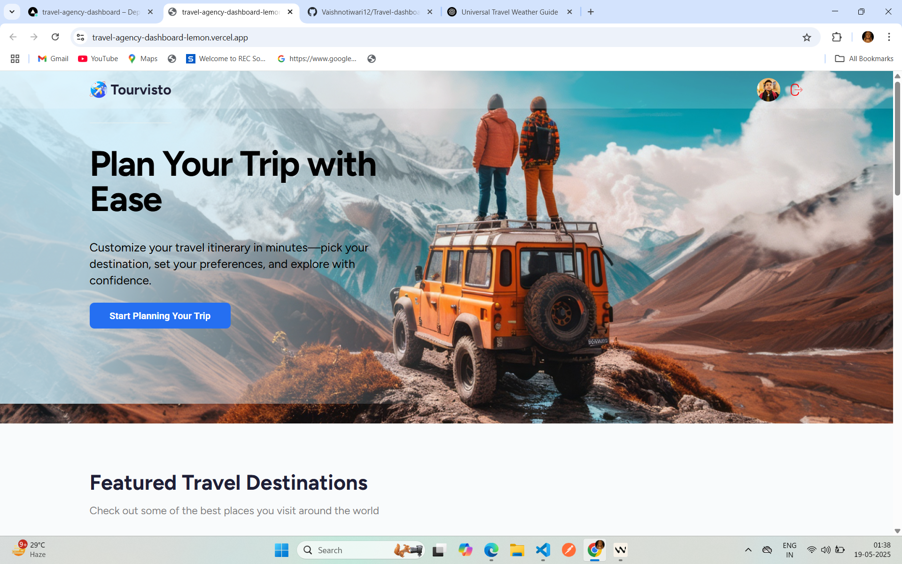

  <h1 align="center">AI Travel Agency dashboard</h1>


<div align="center">
  <a href="">
    
  </a>
 
</div>

## 📁 Project Overview

This is the initial commit of the AI Travel Agency Dashboard project, which includes the core project files and documentation. The project is a modern travel agency platform with an admin dashboard built using React and various modern technologies.

### Key Features in Initial Commit
- Core project structure and configuration files
- Basic React application setup
- Environment configuration templates
- Initial documentation in README.md
- Git and Docker configuration files

### Technology Stack

 <div>
    
    
    
    
  </div>


- React for the frontend framework
- Appwrite for backend services
- Syncfusion for UI components
- Tailwind CSS for styling

### Project Structure
```
travel-agency-dashboard/
├── app/              # Main application code and pages
├── components/       # Reusable UI components
├── contexts/         # React context providers
├── public/           # Static assets
├── .dockerignore     # Docker build configuration
├── .gitignore        # Git configuration
├── .env.example      # Environment variables template
├── package.json      # Project dependencies
└── README.md         # Project documentation
```

## 📱 Connect With Me

<div align="center">
  <a href="https://github.com/Vaishnotiwari12" target="_blank">
    
  </a>
  <a href="https://www.linkedin.com/in/vaishno-prakash-tiwari-989033252/" target="_blank">
    
  </a>
  <a href="https://x.com/VaishnoSatyam" target="_blank">
    
  </a>
  
</div>

## 🌐 Project Links

<div align="center">
  <a href="https://travel-agency-dashboard-lemon.vercel.app" target="_blank">
    
  </a>
  <a href="https://github.com/Vaishnotiwari12/AI-Travel-dashboard" target="_blank">
    
  </a>
</div>

## 👤 Made by

<div align="center">
  <a href="https://github.com/Vaishnotiwari12">
    
  </a>
</div>

---

<p align="center">🚀 Built with ❤️ and modern technologies</p>

## 📋 <a name="table">Table of Contents</a>

1. 🤖 [Introduction](#introduction)
2. ⚙️ [Tech Stack](#tech-stack)
3. 🔋 [Features](#features)
4. 🤸 [Quick Start](#quick-start)
5. 🕸️ [Snippets (Code to Copy)](#snippets)
6. 🔗 [Assets](#links)
7. 🚀 [More](#more)

## <a name="introduction">🤖 Introduction</a>

A modern travel agency platform with an admin dashboard and public site. Generate AI-powered trip itineraries based on country, travel style, interests, group type, and budget — and book trips with ease.

## <a name="tech-stack">⚙️ Tech Stack</a>

- Syncfusion
- React Router v7 (framework mode)
- Appwrite
- Tailwind CSS
- Vite
- React 19

## <a name="features">🔋 Features</a>

### Features of the Travel Agency Project

👉 AI-powered trip itinerary generator

👉 Trip booking functionality on the public website

👉 Admin dashboard with trip and user management

👉 User growth metrics and trip analytics

👉 Interactive charts and trip statistics table

👉 Detailed trip overview

👉 Responsive UI with a modern design

👉 Secure user authentication and data management

👉 Modular code architecture with reusable components

and many more, built for scalability and a smooth user experience.

## <a name="quick-start">🤸 Quick Start</a>

Follow these steps to set up the project locally on your machine.

**Prerequisites**

Make sure you have the following installed on your machine:

- [Git](https://git-scm.com/)
- [Node.js](https://nodejs.org/en)
- [npm](https://www.npmjs.com/) (Node Package Manager)

**Cloning the Repository**

```bash
git clone https://github.com/adrianhajdin/travel-agency-dashboard.git
cd travel-agency-dashboard
```

**Installation**

Install the project dependencies using npm:

```bash
npm install
```

**Set Up Environment Variables**

Create a new file named `.env` in the root of your project and add the following content:

```env
VITE_SYNCFUSION_LICENSE_KEY=
VITE_APPWRITE_PROJECT_ID=
VITE_APPWRITE_API_ENDPOINT=
VITE_APPWRITE_API_KEY=
VITE_APPWRITE_DATABASE_ID=
VITE_APPWRITE_USERS_COLLECTION_ID=
VITE_APPWRITE_ITINERARY_COLLECTION_ID=
STRIPE_SECRET_KEY=
GEMINI_API_KEY=
UNSPLASH_ACCESS_KEY="
VITE_BASE_URL="http://localhost:5173"
```

### Replace the placeholder values with your actual credentials.

- **[Syncfusion](https://jsm.dev/tourvisto-syncfusion)**

- **[Appwrite](https://jsm.dev/tourvisto-appwrite)**

- **[Gemini AI](https://aistudio.google.com/)**

- **[Sentry](https://jsm.dev/tourvisto-sentry)**

- **[Stripe](https://stripe.com/)**

- **[Unsplash](https://unsplash.com/)**

**Running the Project**

```bash
npm run dev
```

Open [http://localhost:5173](http://localhost:5173/) in your browser to view the project.


